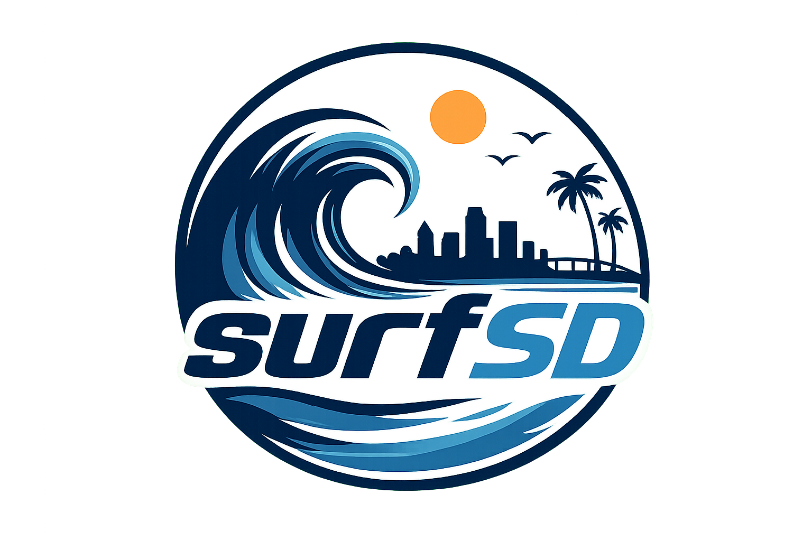
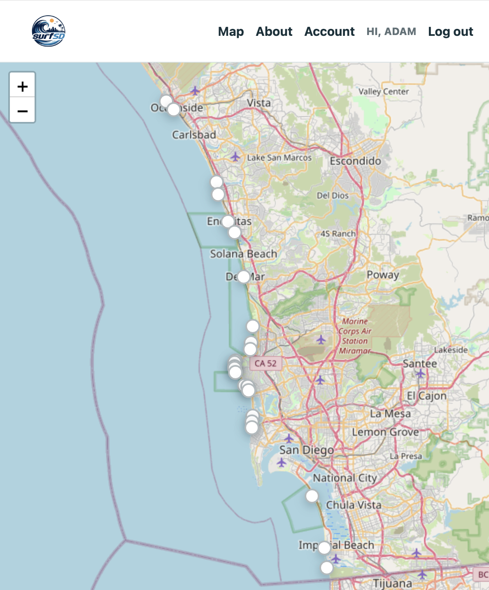
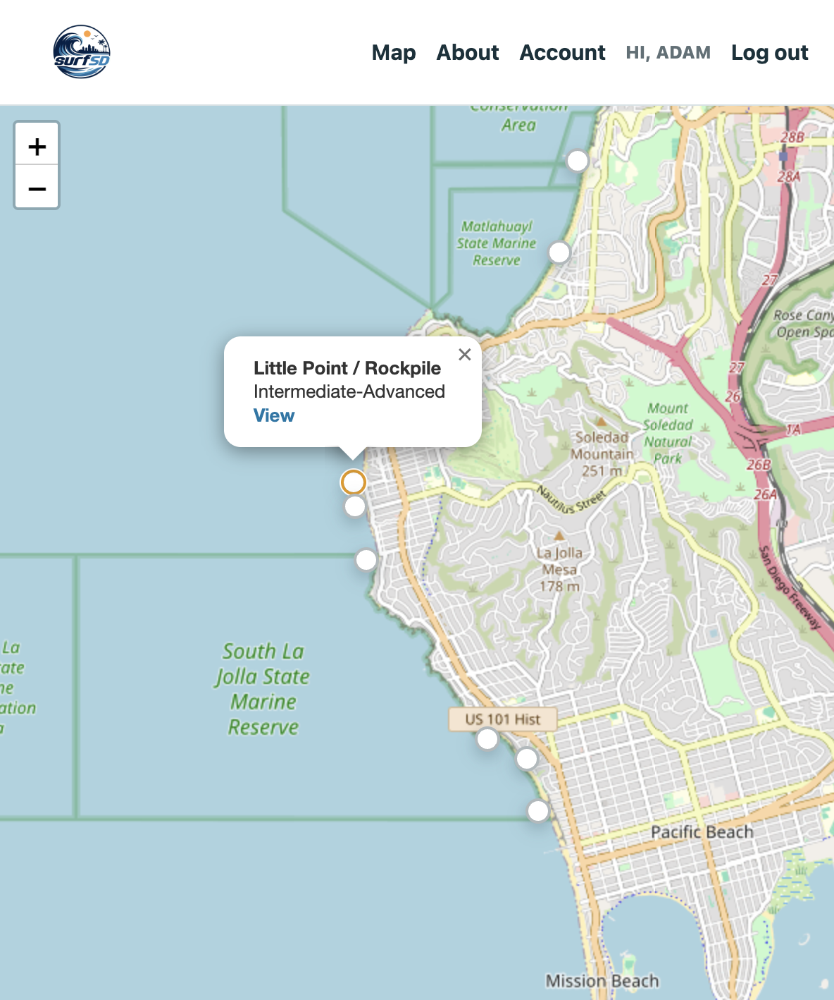
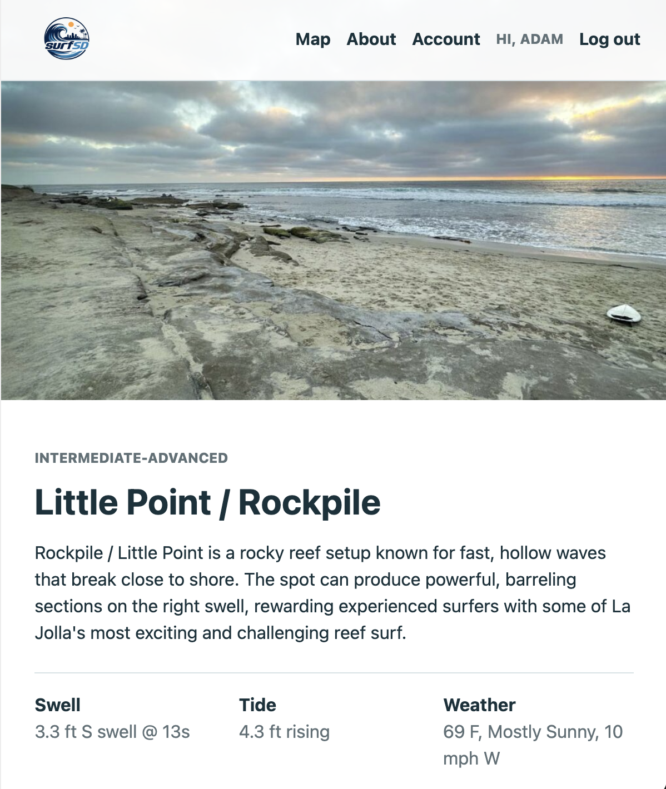
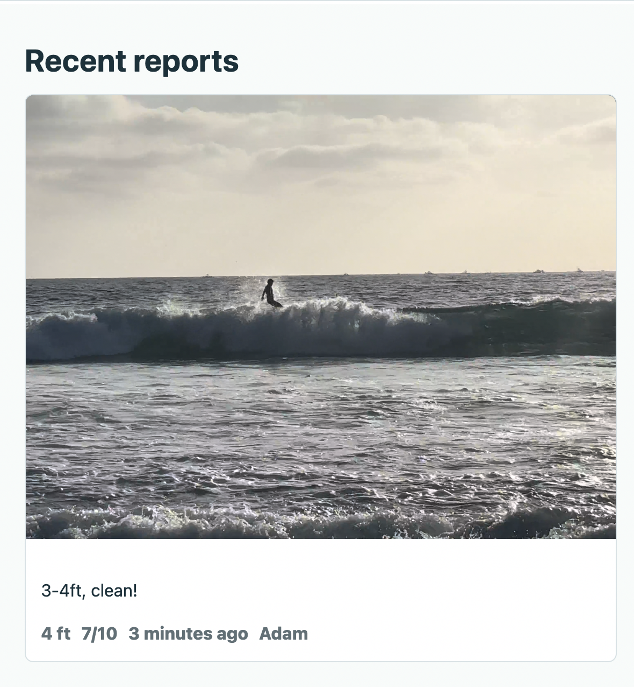
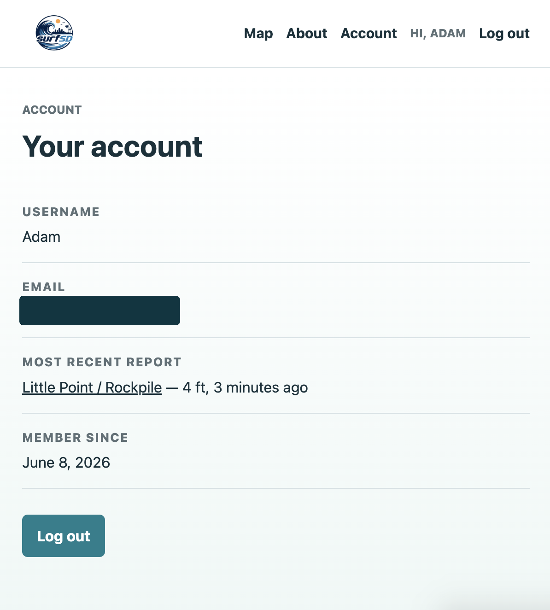

<div align="center">
  

  # SurfSD

  **A community driven surf reporting platform for San Diego surfers.**
</div>

## About the Project

SurfSD is a full stack web application I made to make local surf conditions more accessable. Surf cameras and forecast charts are helpful, but they do not always show what the waves actually look like from the beach. SurfSD lets local surfers share first hand reports for spots across San Diego.

Users can explore surf spots on an interactive map, view current swell, tide, and weather information, create an account, and publish a report with wave height, an optional rating, a description, and an optional video.

This is an ongoing student project, so I am continuing to improve the design, data accuracy, uploads, and deployment setup.

### Surf Map

The map displays surf spots from North County to the border. Each marker opens a popup with the spot name, difficulty, and a link to its page where you can make your own report.





### Surf Spot

Each spot has its own page with a local image, description, difficulty, and spot specific swell, tide, and weather conditions.



### Reports

Users with an account can publish condition reports. Reports include wave height, a description, an optional 1–10 rating, an optional video, the author, and a relative timestamp.



### User Accounts

Users can sign up, log in, log out, and view their account details and most recent report.



## Features

- Interactive Leaflet map with custom surf spot markers
- Individual pages for surf spots across San Diego County
- Live swell data from a NOAA buoy
- Current tide height and rising, falling, or steady trend
- Hourly weather conditions from the National Weather Service
- Account signup, login, logout, and account overview
- Protected report creation for authenticated users
- Surf reports with descriptions and wave heights up to 100 feet
- Optional 1–10 ratings and MP4, WebM, or MOV videos
- Relative timestamps such as "3 minutes ago"
- Responsive server rendered interface
- Automated tests for authentication, reports, validation, pages, uploads, and tides

## What I Used

- **JavaScript** for the frontend and backend
- **Node.js 24** with a native HTTP server
- **HTML and CSS** for the user interface
- **SQLite** using Node's built-in SQLite module
- **Leaflet** and **OpenStreetMap** for the interactive map
- **NOAA NDBC** for swell readings
- **NOAA Tides & Currents** for tide data
- **National Weather Service API** for local weather
- **Node test runner** for automated testing

I intentionally built this project without a web framework to better understand routing, HTTP requests, cookies, form handling, validation, databases, and server rendered HTML.

## Security and Validation

- Passwords are salted and hashed with crypto.scrypt, plain text passwords are never stored.
- Session IDs are randomly generated and protected with HMAC signatures.
- Session cookies use HttpOnly and SameSite=Lax.
- Report creation routes require an authenticated user.
- Signup, login, and report form inputs are validated on the server.
- Video uploads are limited to MP4, WebM, and MOV files.
- Upload requests are limited to 50 MB.
- Secrets and local database files are excluded from Git with .gitignore.
- A Content Security Policy limits which external resources the browser can load.

## Running the Project Locally

### Requirements

- Node.js 24 or newer
- npm, which is included with most Node.js installations

### Setup

1. Clone the repository:

   ```bash
   git clone https://github.com/adamh02/SurfSD.git
   cd SurfSD
   ```

2. Create your local environment file:

   ```bash
   cp .env.example .env
   ```

3. Replace the example SESSION_SECRET in .env with a long random value.

4. Load the environment variables and start the server:

   ```bash
   set -a
   source .env
   set +a
   npm start
   ```

5. Open [http://127.0.0.1:3000](http://127.0.0.1:3000) in your browser.

The SQLite database is created and seeded automatically the first time the application starts.

## Testing

Run the complete automated test suite with:

```bash
npm test
```

The tests cover:

- Signup and secure password hashing
- Account page information
- Surf spot page loading
- Local surf spot images
- Authentication requirements for reports
- Successful report creation
- Optional videos and ratings
- Form validation
- Upload-size error handling
- Rising and falling tide calculations

## Structure

```text
SurfSD/
├── docs/screenshots/       # README screenshots
├── public/                 # CSS, map code, logos, spot images, and uploads
├── src/
│   ├── app.js              # Routes and request handlers
│   ├── auth.js             # Authentication and password hashing
│   ├── conditions.js       # Swell, tide, and weather API requests
│   ├── config.js           # Environment-based configuration
│   ├── db.js               # SQLite schema and database queries
│   ├── httpUtils.js        # Forms, uploads, responses, and static files
│   ├── seedSpots.js        # San Diego surf spot data
│   ├── server.js           # Server entry point
│   ├── session.js          # Signed session management
│   ├── validation.js       # Report validation
│   └── views.js            # Server rendered HTML pages
├── tests/                  # Automated application tests
├── .env.example            # Example environment variables
└── package.json            # Project scripts and Node version
```

## Current Limitations

- The application currently runs locally and does not have a public deployment.
- Uploaded videos are saved to local storage, which is intended for demonstrations rather than a large public platform.
- Sessions are stored in memory and reset when the server restarts.
- SQLite is a good fit for the current version but would need a production hosting plan for a larger application.
- Live conditions depend on external government APIs and may temporarily show as unavailable if sites are down.

## Future Improvements

- Deploy a public read only or rate limited demo
- Move report media to secure cloud storage
- Store sessions in a persistent database
- Add report editing, deleting, and moderation
- Improve accessibility and mobile navigation
- Add more detailed forecasts and map zoom behavior
- Expand to surf communities outside San Diego

## What I Learned

This project helped me practice building a full stack application from the ground up. I learned how frontend pages connect to backend, how relational data is stored and queried, how authentication and signed cookies work, how to validate uploads safely, how to work with external APIs, and how automated tests help prevent old features from breaking while new ones are added.
